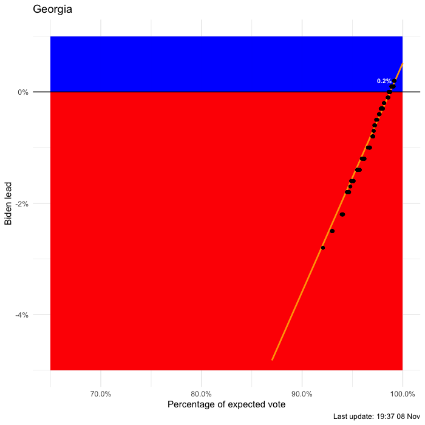

# 2020 US Presidential Races

This is a visualisation of the key swing states during the 2020 US Presidential
election. It was inspired by the work done [here](https://colab.research.google.com/drive/1_aSW2UU827FYu7sFYwYALthzUIu6m0D6?usp=sharing) and [here](https://twitter.com/andy_l_jones/status/1324424103525232641).

An example for Georgia is below which shows the percentage lead that Biden has as proportion of total votes counted. If the lead is positive then it is in the blue zone indicating the Biden is leading the state race. If it is negative, then Trump is leading and the point will be in the red zone. The most recent update is labelled giving the current percentage lead by Biden.

What's interesting is that there are definite trends in how the counting is proceeding which may be extrapolated to predict the outcome when all votes are counted. This is the orange line. If the line cross the 0% line that means the trend has switched from one to the other.

